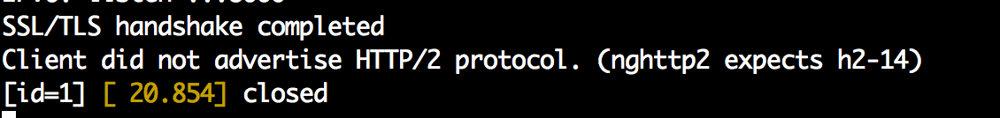

# Ubuntu 14.04 LTS (trusty) for nghttp2
1. Download the nghttpd package
2. Ensure that we have all the package requirements installed
3. Configure, compile and install

The following commands will allow us to do this

     apt-get install make binutils autoconf  automake autotools-dev libtool pkg-config zlib1g-dev libcunit1-dev libssl-dev libxml2-dev libev-dev libevent-dev libjansson-dev libjemalloc-dev cython python3.4-dev
     
    $ autoreconf -i
    $ automake
    $ autoconf
    $ ./configure
    $ make

* Reference - [Installing nghttp2 server](https://nghttp2.org/documentation/package_README.html)*     
     
# Start the server

Starting without `TLS`

    $ nghttpd 8000 --no-tls -d ~/htdocs 

# Connect the client    

    $ nghttp -nv http://127.0.0.1:8000

    
# Getting Curl to work!!!
1. Install another library called `nghttp2`
2. Download curl sources (> 7.33.0) and compile them with `nghttp2`

Install nghttp2

    $ git clone https://github.com/tatsuhiro-t/nghttp2.git
    $ cd nghttp2
    $ autoreconf -i
    $ automake
    $ autoconf
    $ ./configure --prefix=/usr/local
    $ make
    
    $ sudo make install
    
Install curl with support for nghttp2

    $ ./configure --with-nghttp2=/usr/local
    $ make

Run the command     
    
    $ curl https://127.0.0.1:8000 -k --http2 -v       

# Browsers
- Currently Firefox and Chrome support HTTP2 by default. 
- Firefox only with TLS

# Installing Server Certificate

From [Digital Ocean](https://www.digitalocean.com/community/tutorials/how-to-create-a-ssl-certificate-on-apache-for-ubuntu-14-04)

    mkdir ~/ssl
    sudo openssl req -x509 -nodes -days 365 -newkey rsa:2048 -keyout ~/ssl/http2.key -out ~/ssl/http2.crt

# Server with TLS

    $ ./nghttpd 8000 ~/ssl/http2.key ~/ssl/http2.crt -d ~/htdocs/ -v    

# Burp Fails to connect! 

## More evidence of Burp not supporting HTTP2

# Looking at traffic using Wireshark
- Wireshark has support for `http2`
- We require the development version to work with it
    
    
    

